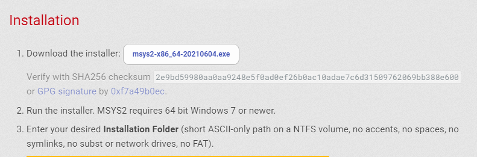
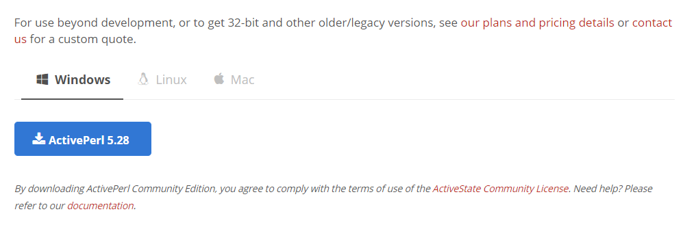
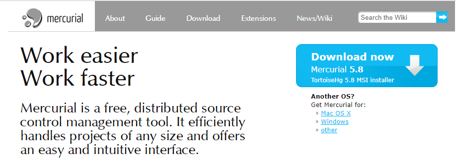
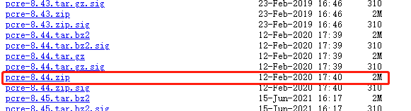
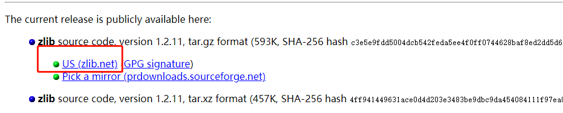
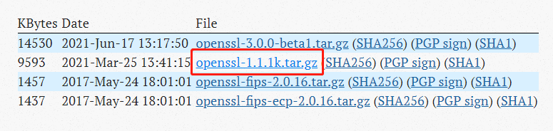
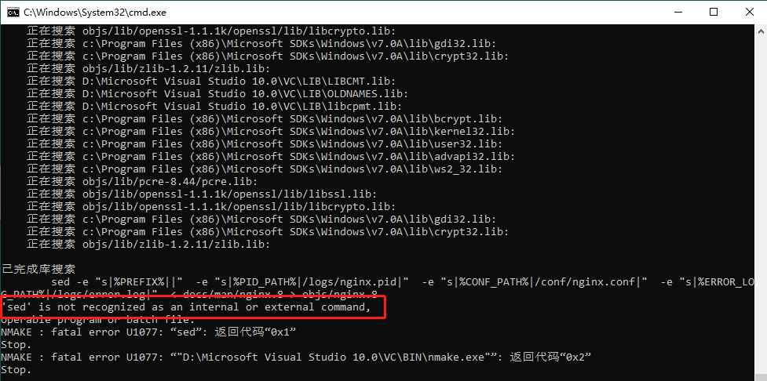

#### 0x00：安装编译所需工具
- 我本机有`Visual Studio 2010`就不再安装
- [MSYS2](https://www.msys2.org/)


- [ActivePerl](https://www.activestate.com/products/perl/downloads/)


- [Mercurial](https://www.mercurial-scm.org/)


#### 0x01：安装Nginx编译模块
- [PCRE](https://ftp.pcre.org/pub/pcre/)


- [zlib](https://ftp.pcre.org/pub/pcre/)


- [OpenSSL](https://www.openssl.org/source/)


#### 0x02：下载Nginx包
打开`MSYS2`运行命令
``` bash
hg clone http://hg.nginx.org/nginx
```
创建目录`objs`和`objs/lib`
``` bash
mkdir objs
mkdir objs/lib
```
将`pcre`、`zlib`、`openssl`解压至`objs/lib`目录下

#### 0x03：生成Makefile
``` bash
auto/configure \
    --with-cc=cl \
    --with-debug \
    --prefix= \
    --conf-path=conf/nginx.conf \
    --pid-path=logs/nginx.pid \
    --http-log-path=logs/access.log \
    --error-log-path=logs/error.log \
    --sbin-path=nginx.exe \
    --http-client-body-temp-path=temp/client_body_temp \
    --http-proxy-temp-path=temp/proxy_temp \
    --http-fastcgi-temp-path=temp/fastcgi_temp \
    --http-scgi-temp-path=temp/scgi_temp \
    --http-uwsgi-temp-path=temp/uwsgi_temp \
    --with-cc-opt=-DFD_SETSIZE=1024 \
    --with-pcre=objs/lib/pcre-8.44 \
    --with-zlib=objs/lib/zlib-1.2.11 \
    --with-openssl=objs/lib/openssl-1.1.1k \
    --with-openssl-opt=no-asm \
    --with-http_ssl_module \
    --with-http_stub_status_module \
    --with-http_v2_module
```
#### 0x04：编译Nginx
运行`cmd`进入`nginx`目录输入`nmake`
``` bash
nmake
```
#### 0x05：运行Nginx
将编译生成地`nginx.exe`拷贝至老版本的Nginx目录子即可(`做好备份`)

#### 0x06：常见错误
 - 未找到`nmake`命令
  将`D:\Microsoft Visual Studio 10.0\VC\bin` 设置到环境变量`path`中
 - 未找到`mspdb100.dll`
  将`D:\Microsoft Visual Studio 10.0\Common7\IDE`中的`mspdbsrv.exe`、`mspdbcore.dll`、`mspdb100.dll`、`msobj100.dll`拷贝到`D:\Microsoft Visual Studio 10.0\VC\bin`
 - `Can't locate Win32/Console.pm at /Perl64/site/lib/ActivePerl/Config.pm line 400`
  注释掉`_warn`
  ``` perl
  sub _warn {
    #   my($msg) = @_;
    #   unless (-t STDOUT) {
    # print "\n$msg\n";
    # return;
    #   }
    #   require Win32::Console;
    #   unless ($console) {
    # $console = Win32::Console->new(Win32::Console::STD_OUTPUT_HANDLE());
    #   }
    #   my($col,undef) = $console->Size;
    #   print "\n";
    #   my $attr = $console->Attr;
    #   $console->Attr($Win32::Console::FG_RED | $Win32::Console::BG_WHITE);
    #   for (split(/\n/, "$msg")) {
    # $_ .= " " while length() < $col-1;
    # print "$_\n";
    #   }
    #   $console->Attr($attr);
    #   print "\n";
  }
  ```
  - 未找到头文件`\nginx\objs\lib\openssl-1.1.1k\include\internal/cryptlib.h(13) : fatal error C1083: 无法打开包括文件:“stdlib.h”: No such file or directory`(其他头文件错误也一样操作)
     - 打开`cmd`进入`D:\Microsoft Visual Studio 10.0\VC`目录后输入`vcvarsall.bat`
     - 进入`nginx`目录后输入`nmake`
 - 未找到`sed`命令
   - 安装[sed](https://webwerks.dl.sourceforge.net/project/gnuwin32//sed/4.2.1/sed-4.2.1-setup.exe)
     \
 - Wno-deprecated-declarations 
    打开`objs\Makefile`删除`-Wno-deprecated-declarations`
  
0x06：参考
- [Building nginx on the Win32 platform with Visual C](http://nginx.org/en/docs/howto_build_on_win32.html)
  