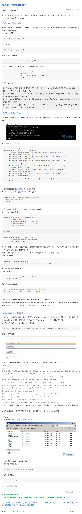

#### 0x00: Puppeteer介绍
[Puppeteer](https://pptr.dev/) 是 Chrome 开发团队在 2017 年发布的一个 Node.js 包，用来模拟 Chrome 浏览器的运行。

#### 0x01: 应用场景
- 自动化测试
- 爬虫
- 网页/富文本截图或导出
- 自动化代码注入

#### 0x02: 代码检出
``` bash
 git clone https://github.com/z41z/pptr-online
```
#### 0x03: 安装依赖
``` bash
  npm i
```

#### 0x04: 运行
```
 npm run start // 或者npm run dev
```
运行成功后用浏览器打开`http://localhost:3000`即可。

#### 0x05: 使用
``` bash
  curl "http://localhost:3000/screenshot?type=image" -o screenshot.png
  curl -X POST "http://localhost:3000/screenshot" -H "Content-Type: application/json" --data "{\"type\":\"image\",\"encoding\":\"base64\"}"
```
#### 0x06: 部署
  - 本地化部署：直接将项目运行起来即可。
  - 容器化部署
  ``` dockerfile
  FROM node:latest
  COPY ./ /pptr_online
  # 拷贝Windows字体到容器，需将字体文件放Fonts目录
  COPY fonts /usr/share/fonts
  WORKDIR /pptr_online
  # 安装必备包
  RUN apt update&&apt-get install -y libatk-bridge2.0.0 libgtk-3.0 fontconfig libnss3-dev libasound2
  RUN npm config set puppeteer_download_host=https://storage.googleapis.com.cnpmjs.org
  RUN npm i
  WORKDIR /pptr_online/src
  CMD [ "node","server.js" ]
  EXPOSE 3000
  ```
#### 0x07: 参数说明
  - url
    网页地址,需要url编码
  - type
    导出类型(可选`image`,`pdf`,`text`)
  - selector
    导出选择器内容(需要url编码,例如#s-top-left > a:nth-child(6)编码为%23s-top-left%20>%20a%3Anth-child(6)),默认值`html`,`pdf`指定选择器时样式会丢失
  - width
    页面视口宽度(type为`image`时且指定了`full`时不生效)
  - height
    页面视口高度(type为`image`时且指定了`full`时不生效)
  - encoding
    图片导出方式(可选值`base64`,`binary`,type为`image`时生效)
  - full
    图片全屏导出(默认`视口[非全屏]`导出,填写`任意值`则为全屏导出,type为`image`时生效)
  - headers
    请求头(必须为`JSON字符串`)
  - js
    注入的JavaScript代码
  - displayHeaderFooter
    是否显示页眉和页脚(传任意值则显示页眉页脚type为`pdf`有效)
  - headerTemplate
    页眉模板(type为`pdf`且`displayHeaderFooter`为`true`有效,富文本标签[其中`class`值取`date`,`title`,`url`,`pageNumber`,`totalPages`时可取对应的值])
  - footerTemplate
    页脚模板(type为`pdf`且`displayHeaderFooter`为`true`有效,富文本标签[其中`class`值取`date`,`title`,`url`,`pageNumber`,`totalPages`时可取对应的值])
  - margin
    页边距(type为`pdf`有效),默认上下边距`50px`,可修改。例如:`{top:'20px',right:'20px',bottom:'20px',left:'20px'}`
  
#### 0x08: 获取网页选择器的内容
``` js
export const exportPdfPost = async (options = {}) => {
  let data = ''
  data = await fetch(`http://localhost:3000/screenshot?url=https://www.baidu.com/&type=text&selector=%23hotsearch-content-wrapper%20>%20li%3Anth-child(4)%20>%20a%20>%20span.title-content-title`, {
    method: 'GET'
  }).then(res => {
    return res.text()
  })
  // "2021春运将从1月28日开始"
}
```
#### 0x09: POST请求文件下载
- 文件下载
  ``` js
    const exportPDF = (options = {}) => {
      let data = {
        "url": encodeURIComponent("https://www.secpulse.com/archives/107874.html"),
        "type": "image",
        "encoding": "binary",
        "selector": encodeURIComponent(".left-9-article"),
        "js": "console.log('test')"
      }
     fetch(`/sceenshot`, {
        method: 'POST',
        body: JSON.stringify(data),
        headers: new Headers({
          'Content-Type': 'application/json'
        }),
      }).then(res => {
        return res.blob()
      }).then(blob => {
        let link = document.createElement('a');
        link.href = window.URL.createObjectURL(blob);
        link.download = decodeURI('export.png')
        link.click();
      })
    }
  ```
  结果如下：
  

  #### 0x10: 参考
  - [Puppeteer文档](https://pptr.dev/)
  - [Puppeteer仓库](https://github.com/puppeteer/puppeteer)
  - [Node.js](https://nodejs.org/en/docs/)
  - [Express](https://expressjs.com/zh-cn/)
  - [Pug](https://pugjs.org/)
  - [MDN](https://developer.mozilla.org/zh-CN/docs/Web/API)
  - [Docker手册](https://yeasy.gitbook.io/docker_practice/)