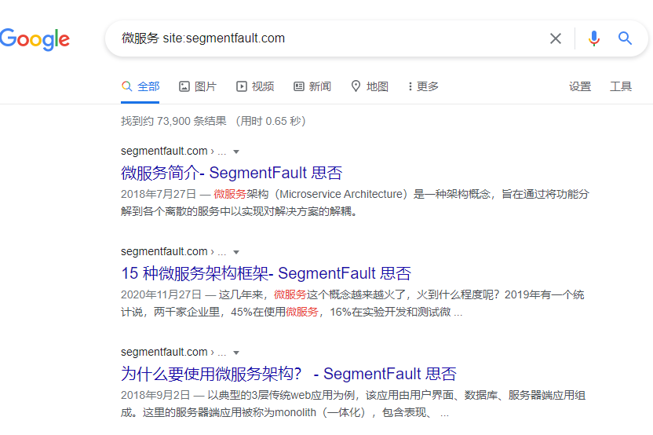

#### 0x00：提取问题的关键词
搜索引擎输入的关键字尽可能精简，避免`口水话`式关键字。
  - 示例1：我想知道`花儿为什么这样红`
    - 搜索关键字`花儿为什么这样红`
    - 搜索结果：
    
    - 搜索关键字`花儿为什么红`和前一关键字相同的结果
    - 搜索结果：
    
    - 搜索关键字`花为什么红`
    - 搜索结果：
    

#### 0x01：筛选结果信息列表
  - 域名：针对开发者问题搜索最好无视域名含有`csdn.com`、`jianshu.com`、`baidu.com`、`huaweicloud.com`、`cloud.tencent.com`、`aliyun.com`的搜索结果
  - 专业术语：过滤专业术语大小写不规范的搜索结果(例如:`MySQL`写成mysql,`CentOS`->centos,`ES6`->es6,`Java`->java,`Docker`->docker,`JavaScript`->javascript等)
  - 故意夸大：`零基础`、`轻松学习`、`xxx入门到精通`、`免费`

#### 0x02：常用Google搜索语法
  - site(指定搜索某个域名下的信息)
    - 搜索`思否`下关于`微服务`的所有信息
      - 搜索词：`微服务 site:segmentfault.com`
      - 搜索结果：
      
  - filetype(指定搜索某个文件类型)
    - 搜索成都市和`创业`相关PDF格式的的政府文件
      - 搜索词：`创业 site:chengdu.gov.cn filetype:pdf`
      - 搜索结果：
      
  - and(条件和搜索)
    - 搜索成都市和`创业`且和`就业`相关PDF格式的的政府文件
      - 搜索词：`创业 and 就业 site:chengdu.gov.cn filetype:pdf`
      - 搜索结果：
      
  - or(条件或搜索)
    - 搜索成都市和`创业`且和`就业`相关PDF格式的的政府文件
      - 搜索词：`创业 and 就业 site:chengdu.gov.cn filetype:pdf`
      - 搜索结果
      
  - -(排除某个搜索结果)
    - 搜索`Nginx编译`并排除`CSDN`和`huaweicloud`的搜索结果
      - 搜索词：`nginx编译 -csdn -huaweicloud`
      - 搜索结果
    
  - ""(全匹配)：搜索引擎不会对搜索词进行分词处理。
    - 搜索`"春江潮水"`
      - 搜索词：`"春江潮水"`
      - 搜索结果
    
  - 有用的域名后缀
    - gov.cn 搜政府网站上关于人口普查文件
      - 搜索词：`site:gov.cn filetype:pdf`
      - 搜索结果：
      
    - edu.cn 搜大学网站关于收费信息
      - 搜索词：`收费 site:edu.cn filetype:xls`
      - 搜索结果：
      

#### 0x04：Google Hacking
  - inurl：搜索链接中包含的关键字
  - intitle：搜索标题包含的关键字
  - intext：搜索描述包含的关键字
  - [Google Hacking Database](https://www.exploit-db.com/google-hacking-database)

#### 0x05：参考
  - [Google-Search-Operators-Cheat-Sheet](../files/Google-Search-Operators-Cheat-Sheet.pdf)