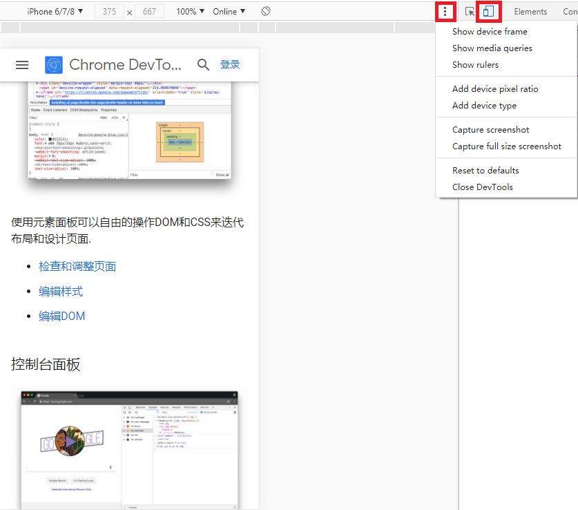
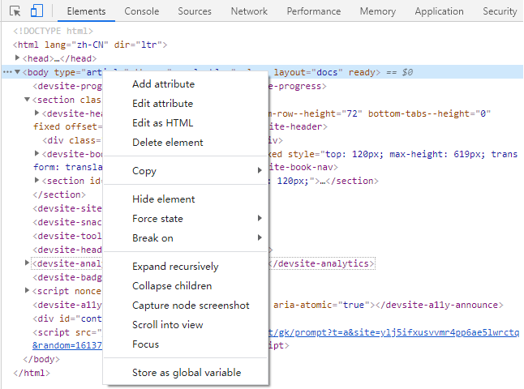
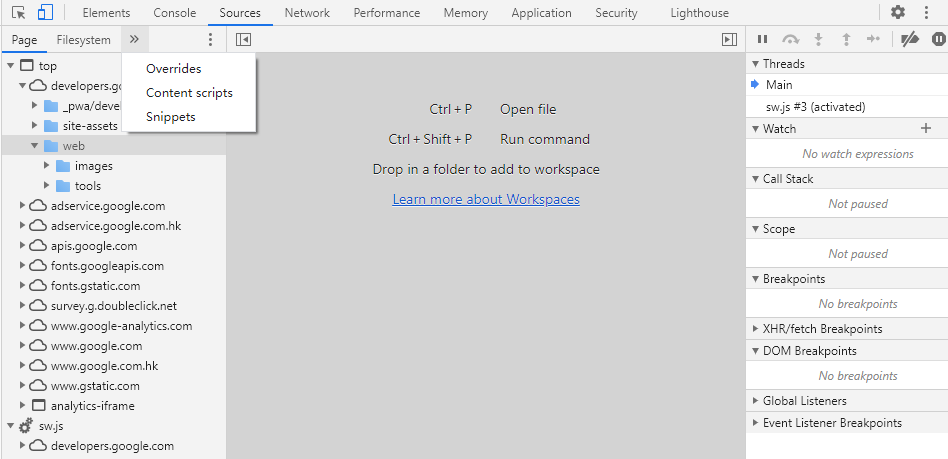
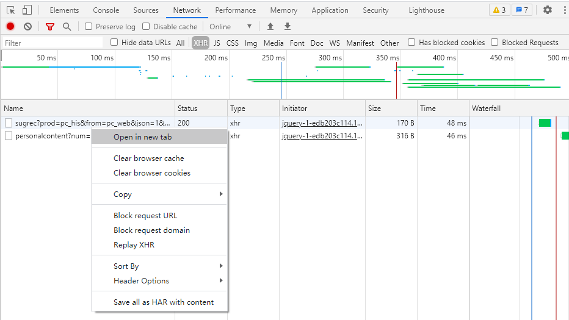
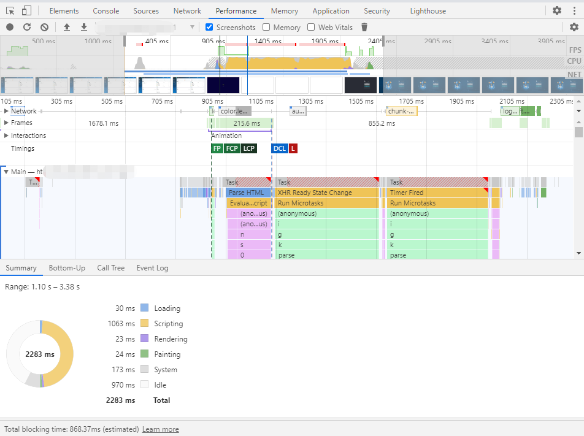
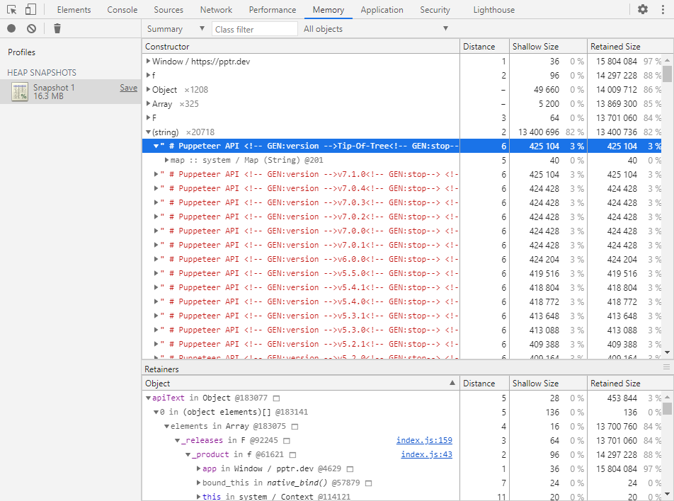
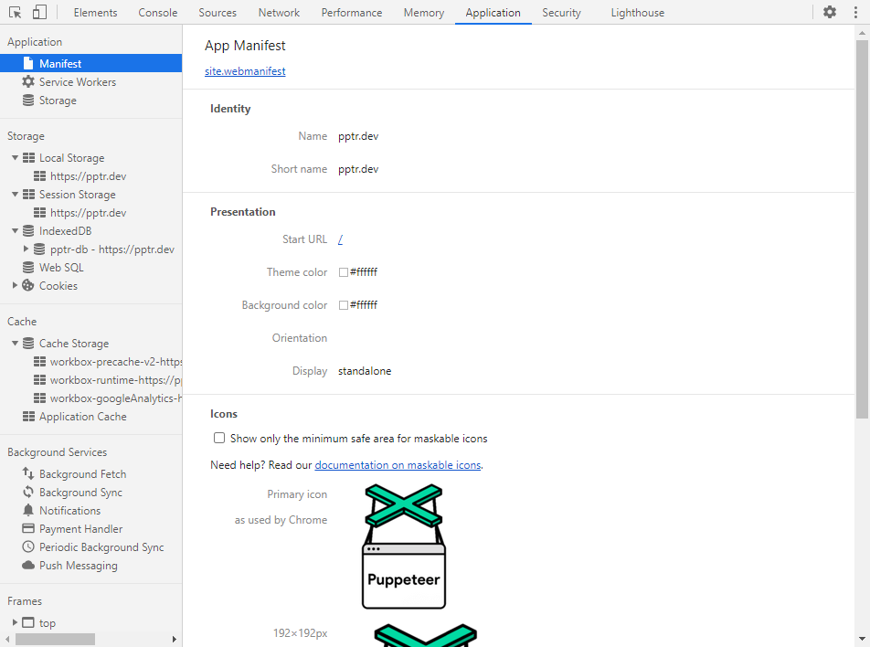
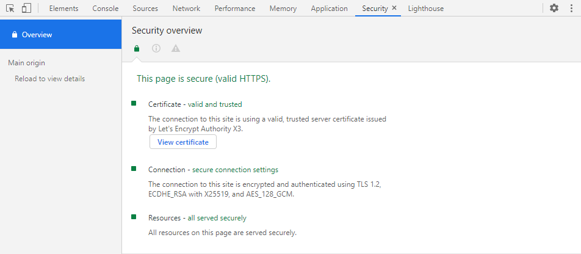
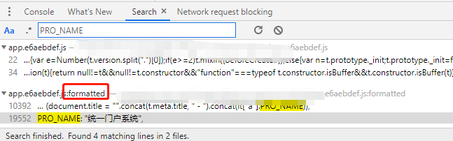

#### 0x00: 介绍
  Chrome DevTools(Chrome开发者工具)是一套内置于Google Chrome中的Web开发和调试工具，可用来对网站进行迭代、调试和分析。

#### 0x01: 设备(Device)
  使用设备模式构建完全响应式，移动优先的网络体验。
  
  - 模拟移动端设备
  - 模拟网络
  - 缩放旋转
  - 响应式
  - 自定义设备
  - 设备边框
  - 设备截图
  - [更多](https://developers.google.cn/web/tools/chrome-devtools#%E8%AE%BE%E5%A4%87%E6%A8%A1%E5%BC%8F)

#### 0x02: 元素(Elements)
  使用元素面板可以自由的操作DOM和CSS来迭代布局和设计页面。
  
  - 添加属性(Add attribute)
  - 编辑属性(Edit attribute)
  - 以HTML形式编辑(Edit as HTML)
  - 删除元素(Delete element)
  - 以HTML形式编辑(Edit as HTML)
  - 复制(Copy)
    - 剪切元素(Cut element)
    - 复制元素(Copy element)
    - 粘贴元素(Paste element)
    - 复制outerHTML(Copy outerHTML)
    - 复制selector(Copy selector)
    - 复制JS路径(Copy JS path)
    - 复制样式(Copy styles)
    - 复制[XPath](https://www.runoob.com/xpath/xpath-tutorial.html)(Copy XPath)
    - 复制完整的[XPath](https://www.runoob.com/xpath/xpath-tutorial.html)(Copy full XPath)
  - 隐藏元素(Hide element)
  - 强制状态(Force state)
    - 激活([:active](https://developer.mozilla.org/zh-CN/docs/Web/CSS/:active))
    - 鼠标悬浮([:hover](https://developer.mozilla.org/zh-CN/docs/Web/CSS/:hover))
    - 获得焦点([:focus](https://developer.mozilla.org/zh-CN/docs/Web/CSS/:focus))
    - 已访问过([:visited](https://developer.mozilla.org/zh-CN/docs/Web/CSS/:visited))
    - 后代焦点([:focus-within](https://developer.mozilla.org/zh-CN/docs/Web/CSS/:focus-within))
    - 键盘鼠标样式区分([:focus-visible](https://developer.mozilla.org/zh-CN/docs/Web/CSS/:focus-visible))
  - 中断于(Break on)
    - 子树修改(subtree modifications)
    - 属性修改(attribute modifications)
    - 删除节点(node removal)
  - 以递归方式展开(Expand recursively)
  - 折叠子项(Collapse children)
  - 节点截图(Capture node screenshot)
  - 页面滚动到节点位置(Scroll into view)
  - 焦点(Focus)
  - 存储为全局变量(Store as global variable)
  - [更多](https://developers.google.cn/web/tools/chrome-devtools#%E5%85%83%E7%B4%A0%E9%9D%A2%E6%9D%BF)

#### 0x03: 控制台(Console)
在开发期间，可以使用控制台面板记录诊断信息，或者使用它作为Shell在页面上与JavaScript交互。
- 日志打印
- 本地调试
- 命令行交互
- [更多](https://developers.google.cn/web/tools/chrome-devtools#%E6%8E%A7%E5%88%B6%E5%8F%B0%E9%9D%A2%E6%9D%BF)

#### 0x04: 源代码(Sources)
在源代码面板中设置断点来调试JavaScript，或者通过Workspaces（工作区）连接本地文件来使用开发者工具的实时编辑器。

- 页面(Page)
- 本地文件系统(Filesystem)
- 文件重写(Overrides)
  - [DNS劫持](https://www.freebuf.com/articles/network/17150.html)
  - [中间人攻击(MITM)](https://www.freebuf.com/sectool/39050.html)
- 监视(Watch)
- 断点(Breakpoints)
- 请求断点(XHR/fetch Breakpoints)
- DOM断点(DOM Breakpoints)
- 事件断点(Event Listener Breakpoints)
- [更多](https://developers.google.cn/web/tools/chrome-devtools#%E6%BA%90%E4%BB%A3%E7%A0%81%E9%9D%A2%E6%9D%BF)

#### 0x05: 网络(Network)
使用网络面板了解请求和下载的资源文件并优化网页加载性能。

- 禁用缓存(Disable cache)
- 网络模式
  - 联机(Online)
  - 3G快速(Fast 3G)
  - 3G慢速(Slow 3G)
  - 离线(Offline)
  - 自定义(Custom)
- 过滤请求
  - 所有(All)
  - XHR请求(XHR)
  - JavaScript(JS)
  - 样式(CSS)
  - 图片(Img)
  - 媒体(Media)
  - 字体(Font)
  - 文档(Doc)
  - WebSocket(WS)
  - 清单([Manifest](https://developer.mozilla.org/zh-CN/docs/Mozilla/Add-ons/WebExtensions/manifest.json))
  - 其他(Other)
- 新标签页打开(Open in new tab)
- 清除浏览器缓存(Clear browser cache)
- 清除浏览器Cookie(Clear browser cookies)
- 复制(Copy)
  - 复制链接地址(Copy link address)
  - 复制请求头(Copy request headers)
  - 复制响应头(Copy response headers)
  - 复制响应(Copy response)
  - 复制栈追踪(Copy stacktrace)
  - 复制为[PowerShell](https://zh.wikipedia.org/zh-cn/Windows_PowerShell)(Copy as PowerShell)
  - 复制为[fetch](https://developer.mozilla.org/zh-CN/docs/Web/API/Fetch_API/Using_Fetch)(Copy as fetch)
  - 复制为Node.js fetch(Copy as Node.js fetch)
  - 复制为[cURL](https://zh.wikipedia.org/zh-hans/CURL)(cmd)(Copy as cURL(cmd))
  - 复制为cURL(bash)(Copy as cURL(bash))
  - 阻止请求URL(Block request URL)
  - 阻止请求域(Block request Domain)
  - 重播XHR(Replay XHR)
- 排序方式(Sort By)
- 标题选项(Header Options)
- 计时(Timing)
  - `排队(Queueing)`：当以下任一项为真时，浏览器将队列请求排成队列。
    - 存在更高优先级的请求。
    - 为同一源打开了`六个TCP`连接，这是限制。仅适用于`HTTP/1.0`和`HTTP/1.1`。
    - 浏览器在磁盘缓存中简要分配空间。
  - `已停止(Stalled)`：请求因队列中所述的任何原因而停止。
  - `DNS查找(DNS Lookup)`：浏览器正在解析请求的IP地址。
  - `初始连接(Initial connection)`：浏览器建立包括 TCP握手、TCP重试和协商安全套接字层在内的连接。
  - `代理协商(Proxy negotiation)`：浏览器正在与代理服务器协商请求。
  - `发送请求(Request sent)`：正在发送请求。
  - `ServiceWorker准备(ServiceWorker Preparation)`：浏览器正在启动服务工作进程。
  - `请求ServiceWorker(Request to ServiceWorker)`：请求将发送给服务工作者。
  - `等待TTFB(Waiting TTFB)`：浏览器正在等待响应的第一个字节。TTFB代表第一个字节的时间。 此时间包括一次延迟往返以及服务器准备响应所花时间。
  - `内容下载(Content Download)`：浏览器正在接收响应。
  - `接收推送(Receiving Push)`：浏览器通过`HTTP/2`服务器推送接收此响应的数据。
  - `读取推送(Reading Push)`：浏览器正在读取之前收到的本地数据。
- [更多](https://developers.google.cn/web/tools/chrome-devtools#%E7%BD%91%E7%BB%9C%E9%9D%A2%E6%9D%BF)

#### 0x06: 性能(Performance)
使用时间轴面板可以通过记录和查看网站生命周期内发生的各种事件来提高页面的运行时性能。

- 截图(Screenshots)
- 内存(Memory)
- 摘要(Summary)
  - 正在加载([Loading](https://developers.google.cn/web/tools/chrome-devtools/evaluate-performance/performance-reference#loading_events))
  - 脚本([Scripting](https://developers.google.cn/web/tools/chrome-devtools/evaluate-performance/performance-reference#scripting_events))
  - 渲染([Rendering](https://developers.google.cn/web/tools/chrome-devtools/evaluate-performance/performance-reference#rendering_events))
  - 绘制([Painting](https://developers.google.cn/web/tools/chrome-devtools/evaluate-performance/performance-reference#painting_events))
  - 系统(System)
  - 空闲(Idle )
- 调用树(Call Tree)
- [更多](https://developers.google.cn/web/tools/chrome-devtools/evaluate-performance/)

#### 0x07: 内存(Memory)
如果需要比时间轴面板提供的更多信息，可以使用“配置”面板，例如跟踪内存泄漏。

- [更多](https://developers.google.cn/web/tools/chrome-devtools/memory-problems)

#### 0x08: 应用(Application)
使用资源面板检查加载的所有资源，包括IndexedDB与Web SQL数据库，本地(localStorage)和会话(sessionStorage)存储，Cookie，应用程序缓存，图像，字体和样式表。

- 应用(Application)
  - 清单(manifest)
  - Service Worker
  - 存储(Storage)
- 存储(Storage)
  - 本地存储
  - 会话存储
  - IndexedDB
  - WebSQL
  - Cookie
- 缓存(Cache)
  - 缓存存储(Cache Storage)
  - 应用缓存(Application Cache)
- [更多](https://developers.google.cn/web/tools/chrome-devtools/progressive-web-apps)

#### 0x09: 安全(Security)
使用安全面板调试混合内容问题，证书问题等等。

- [更多](https://developers.google.cn/web/tools/chrome-devtools/security)

#### 0x10: 搜索(Search)
搜索网页静态资源内容。

#### 0x11: 参考
- [Chrome 开发者工具](https://developers.google.cn/web/tools/chrome-devtools)
- [Microsoft Edge (Chromium) 开发人员工具[中文]](https://docs.microsoft.com/zh-cn/microsoft-edge/devtools-guide-chromium/)
- [Timing-explanation](https://developers.google.cn/web/tools/chrome-devtools/network/reference?utm_source=devtools#timing-explanation)
- [网络分析参考[中文]
](https://docs.microsoft.com/zh-cn/microsoft-edge/devtools-guide-chromium/network/reference#sort-by-activity-phase)