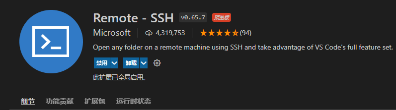
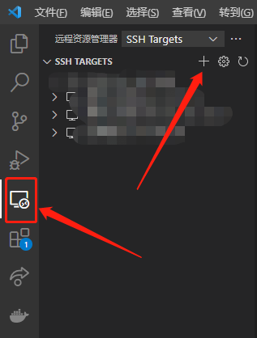
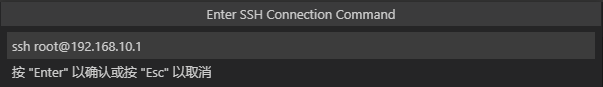
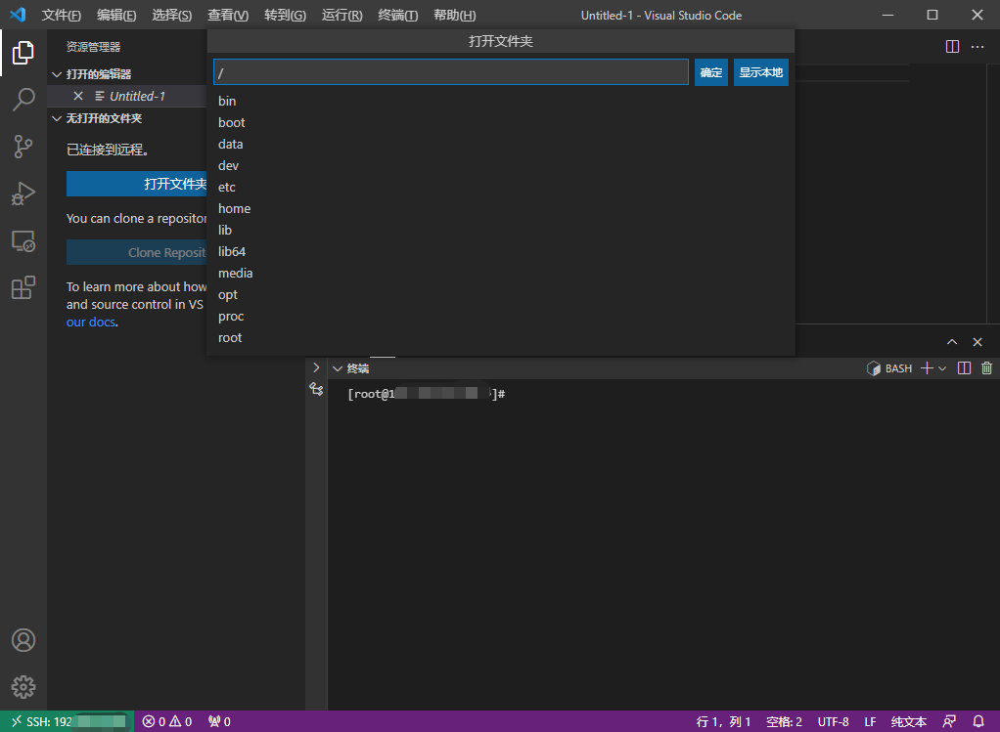
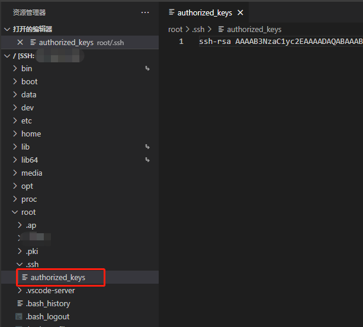
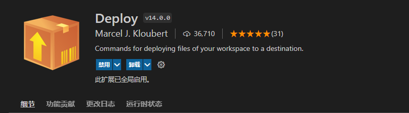
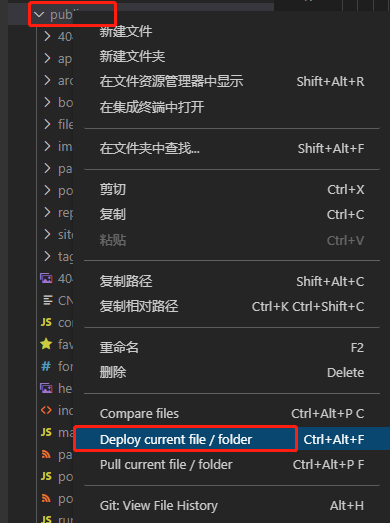

#### 0x00：安装Remote SSH
- `VSCode`扩展栏搜索`remote ssh`后点击安装即可

#### 0x01：添加服务器
- `VSCode`点击左侧`远程资源管理器`后点击`加号`

- `VSCode`顶部中央弹出连接信息,输入`ssh 用户名@服务器地址`即可

- 选择配置文件默认即可
- 添加完成后`远程资源管理器`便会增加一条服务器信息，点击右侧连接即可
- 选择服务器平台后输入服务器密码
- 设置服务器默认文件夹

#### 0x02：免密登录
- 生成密钥
  - 打开`cmd`输入`ssh-keygen -t rsa -b 4096`即可，一路回车后会在`C:\Users\用户名\.ssh\`生成`id_rsa.pub`文件
- 用`记事本`或者`VS Code`打开`id_rsa.pub`，将文件内容复制到`远程服务器` `/root/.ssh/authorized_keys`尾行中，如果没`authorized_keys`则新建，反之追加。如果没有`.ssh`文件夹，则在命令行输入`ssh localhost`即可生成

#### 0x03：安装Deploy
`VSCode`扩展栏搜索`deploy`后点击安装即可

#### 0x04：配置Deploy
- 打开`settings.json`输入以下配置信息
``` json
    "deploy": {
        "packages": [
            {
                "name": "项目名称",
                "description": "项目描述",
                "files": [
                    "dist/**"
                ],
                "deployOnSave": true
            }
        ],
        "targets": [
            {
                "type": "sftp",
                "name": "项目名称",
                "description": "项目描述",
                "dir": "/frontend/mobile/next",
                "host": "服务器IP",
                "port": 22,
                "user": "用户名",
                "password": "密码",
                "checkBeforeDeploy": true,
                "mappings": [
                    {
                        "source": "dist",
                        "target": "dist"
                    }
                ]
            }
        ]
    }
```
#### 0x05：部署项目
- 鼠标右键或者`Ctrl+Alt+F`
