- #### 0x00.代码检出
  ``` node
  git clone https://github.com/PanJiaChen/vue-element-admin . &git checkout 4.4.0
  ```

- #### 0x01.安装辅助依赖
  - progress-bar-webpack-plugin:构建进度条
  ``` node
    npm i progress-bar-webpack-plugin -D
  ```
  - chalk:命令行字体颜色配置
  ``` node
    npm i chalk -D
  ```

- #### 0x02.首次运行耗时
  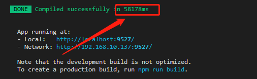

- #### 0x03.第二次运行耗时
  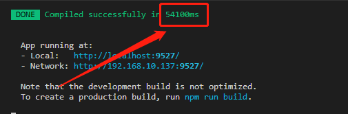

- #### 0x04.第三次运行耗时
  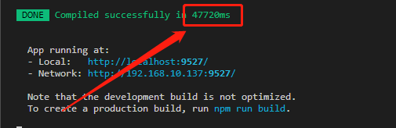

  平均耗时`53s`

- #### 0x05.首次打包耗时
  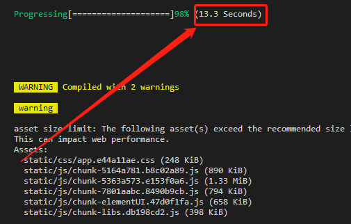

- #### 0x06.第二次打包耗时
  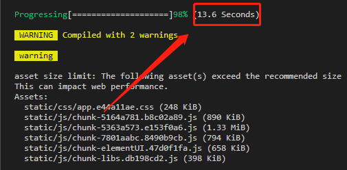
  平均耗时`13.45s`

- #### 0x07.运行耗时远大于打包耗时？
  编辑`vue.config.js`,在`devServer`配置下添加`progress: false`属性。
  ``` js
    devServer: {
      port: port,
      progress: false,
      open: true,
      overlay: {
        warnings: false,
        errors: true
      },
      before: require('./mock/mock-server.js')
    }
  ```
  - 修改后的首次运行耗时
    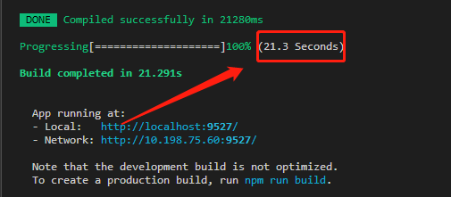

  - 修改后的二次运行耗时
    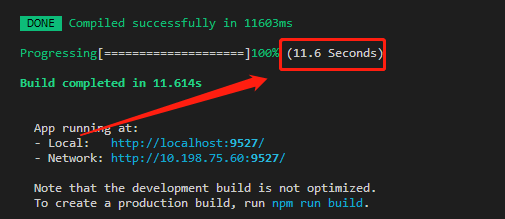

  - 修改后的三次运行耗时
    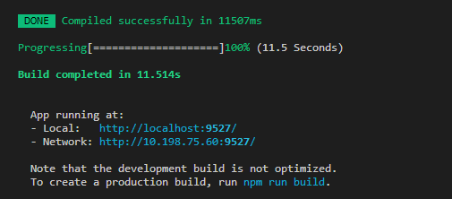

    平均耗时`14.8s`,减少`70%`。

    > 可能是终端读写操作太频繁导致运行耗时远大于打包耗时。

    > 修改后的打包耗时基本差不多,不做过多测试。

- #### 0x08打包并分析结果
  编辑`package.json`,将`build:prod`的值修改为`vue-cli-service build --report`
  ``` json
  "build:prod": "vue-cli-service build --report"
  ```
  运行`npm run build:prod`后会在`dist`目录下生成`report.html`文件，打开即可查看当前的包结构。
    - 总共生成了`76`个`.js`文件，总共大小`4.96MB`，`Gzip`后大小为`1.59MB`
    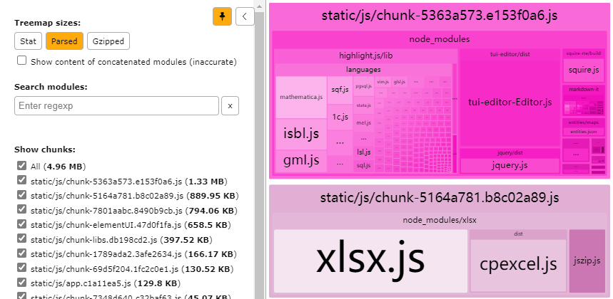
    - 最大的文件`1.33MB`，`Gzip`后大小为`418.2KB`
    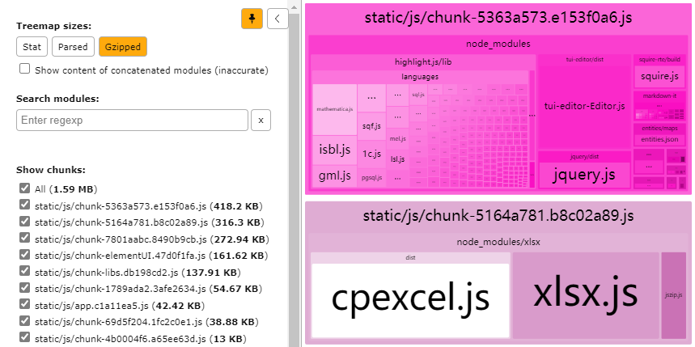

- #### 0x09.拆包与合包
  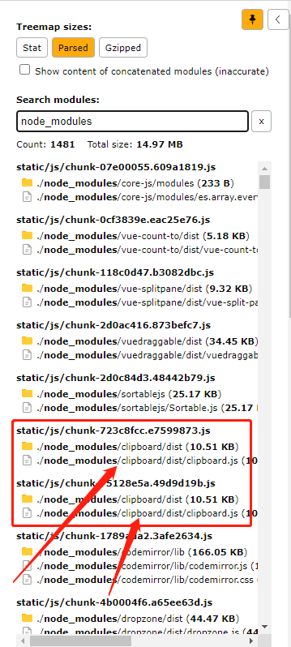

  编辑`vue.config.js`,将`config.optimization.splitChunks`值修改为：
    ``` js
    {
      chunks: 'all',
      cacheGroups: {
        libs: {
          name: 'chunk-libs',
          test: /[\\/]node_modules[\\/]/,
          priority: 10,
          chunks: 'initial'
        },
        // vue相关依赖
        vue: {
          name: 'chunk-vue',
          priority: 99,
          test: /(node_modules[\\/]vue)|(axios)/,
          reuseExistingChunk: true,
          minChunks: 1,
          enforce: true,
        },
        // 通用组件合包
        components: {
          name: `components`,
          test: /(components)/,
          chunks: 'all',
          minChunks: 1,
          reuseExistingChunk: true,
          enforce: true,
          priority: 99
        },
        // 非核心文件夹合包
        src: {
          name: `src`,
          test: /(icons)|(assets)|(vendor)|(utils)|(directive)|(store)|(layout)|(api)/,
          chunks: 'all',
          minChunks: 1,
          reuseExistingChunk: true,
          enforce: true,
          priority: 99
        },
        // 路由级组件合包
        views: {
          name: `views`,
          test: /(views)/,
          chunks: 'all',
          minChunks: 1,
          reuseExistingChunk: true,
          enforce: true,
          priority: 99
        },
        // 其他第三方包合包
        others: {
          name: 'chunk-others',
          priority: 20,
          minChunks: 1,
          reuseExistingChunk: true,
          enforce: true,
          test: /(file\-saver)|(clipboard)|(buffer)|(sortable)|(vuedraggable)|(codemirror)|(jsonlint)|(dropzone)|(driver\.js)|()/
        },
        // 拆分ElementUI
        elementUI: {
          name: 'chunk-elementUI',
          priority: 999,
          test: /(element\-ui)/,
          reuseExistingChunk: true,
          minChunks: 1,
          enforce: true,
        },
        // 拆分Echarts
        echarts: {
          name: 'chunk-echarts',
          priority: 999,
          test: /(echarts)|(zrender)/,
          reuseExistingChunk: true,
          minChunks: 1,
          enforce: true,
        },
        // 拆分highlight
        highlight: {
          name: 'chunk-highlight',
          priority: 999,
          test: /(highlight)/,
          reuseExistingChunk: true,
          minChunks: 1,
          enforce: true,
        },
        // 拆分富文本编辑器
        editor: {
          name: 'chunk-editor',
          priority: 999,
          test: /(tui\-editor)/,
          reuseExistingChunk: true,
          minChunks: 1,
          enforce: true,
        },
        // 拆分Excel插件
        xlsx: {
          name: 'chunk-xlsx',
          priority: 999,
          test: /(xlsx)/,
          reuseExistingChunk: true,
          minChunks: 1,
          enforce: true,
        },
        // 拆分JavaScript转换插件
        corejs: {
          name: 'chunk-corejs',
          test: /(core\-js)/,
          priority: 999,
          reuseExistingChunk: true
        }
      }
    ```

#### 0x10.再次打包并分析结果
  运行`npm run build:prod`后打开`report.html`文件。
  - 总共生成了`14`个`.js`文件，总共大小`4.92MB`，`Gzip`后大小为`1.55MB`
  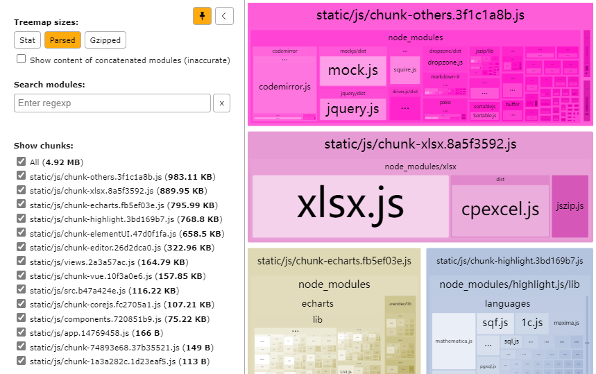
  - 最大的文件`983.11KB`，`Gzip`后大小为`320.29KB`
  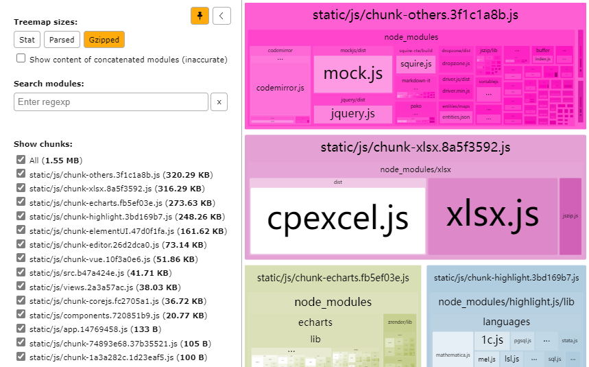
  - `.js`文件的HTTP请求数由`76`个减少到`14`个，减少了`82%`。
  - 总文件大小看似并没有减少多少，是因为未接入更多的业务代码。

#### 0x11.最后
  - `echarts`采用`script`引用的方式会减少不少的构建时间。
  - 对于非核心功能，能不用第三方插件就尽量不用。
  - 拆包与合包必然会增加构建时间，因此，`development`和`production`应该区分配置文件。
  - 在`development`环境中，可以去除`ES6`转换为`ES5`的转换，以减少开发构建时间。
  - 不同的业务系统项目基本目录应该一致，以保证较好的可迁移性。

#### 0x012.补充
  - SCSS变量引入不当导致编译性能瓶颈(2021-06-22)
    ``` scss
    // variables.scss
    $--color-primary: teal;
    /* 改变 icon 字体路径变量，必需 */
    $--font-path: '~element-ui/lib/theme-chalk/fonts';
    @import '~element-ui/packages/theme-chalk/src/index';
    ```
    ``` js
    // vue.config.js
    module.exports = {
      css: {
        loaderOptions: {
          // @/ 是 src/ 的别名
          // 所以这里假设你有 `src/variables.scss` 这个文件
          // 默认情况下 `sass` 选项会同时对 `sass` 和 `scss` 语法同时生效
          // 因为 `scss` 语法在内部也是由 sass-loader 处理的
          // 但是在配置 `prependData` 选项的时候
          // `scss` 语法会要求语句结尾必须有分号，`sass` 则要求必须没有分号
          // 在这种情况下，我们可以使用 `scss` 选项，对 `scss` 语法进行单独配置
          scss: {
            additionalData: `@import "~@/variables.scss";`
          }
        }
      }
    }
    ```

    解决：去除`variables.scss`中的`@import '~element-ui/packages/theme-chalk/src/index'`