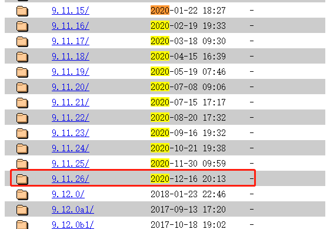
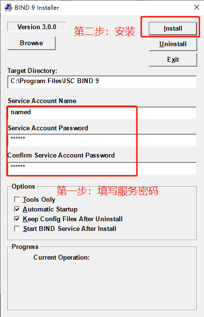
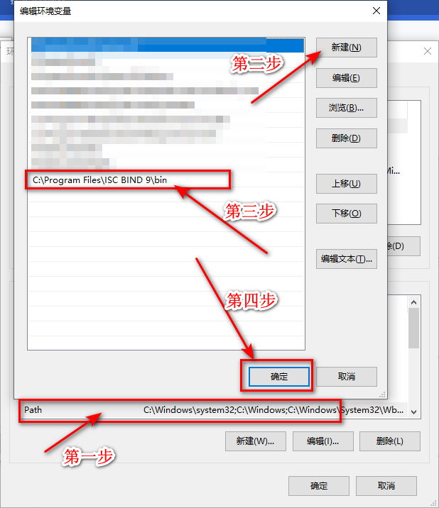
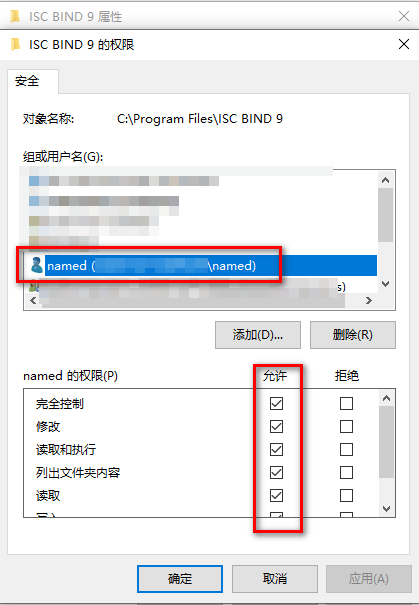
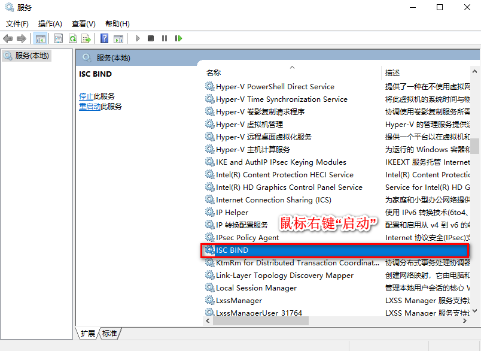
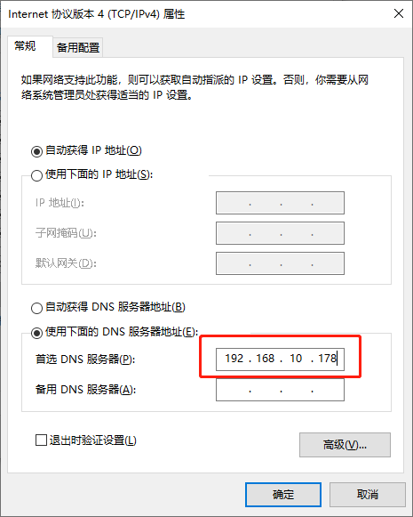
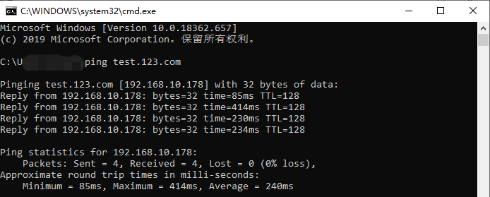

#### 0x00: 下载并安装BIND9.11.26
[下载](http://ftp.isc.org/isc/bind9/9.11.26/)BIND9.11.26[(http://ftp.isc.org/isc/bind9/9.11.26/)](http://ftp.isc.org/isc/bind9/9.11.26/)


#### 0x01: 安装BIND
- 以`管理员身份`运行`BINDInstall.exe`
  
- 填写服务密码并安装
  

#### 0x02: 设置环境变量
<div align=left>

#### 0x03: 设置目录读写权限
  - 右键点击安装目录
  - 选择`安全`选项卡后点击`编辑`
  - 点击`添加`
  - 点击`高级`,弹窗后点击`立即查找`,选中`named`用户并`确定`
  - 勾选权限
  

#### 0x04: 文件配置
  - 生成rndc.key:`管理员身份`运行`cmd`输入`rndc-confgen -a`
  - [下载](ftp://ftp.rs.internic.net/domain/)`named.root`和`root.zone`[(ftp://ftp.rs.internic.net/domain/)](ftp://ftp.rs.internic.net/domain/))
  - 创建`localhost.zone`
    ``` bash
      $TTL 1D
      @ IN SOA localhost. root.localhost. (
      2007091701  ; Serial
      30800  ; Refresh
      7200  ; Retry
      604800  ; Expire
      300 )  ; Minimum
      IN NS localhost.
      localhost. IN A 192.168.10.178
    ```
  - 创建`localhost.rev`
    ``` bash
      $TTL 1D
      @ IN SOA localhost. root.localhost. (
      2007091701  ; Serial
      30800  ; Refresh
      7200  ; Retry
      604800  ; Expire
      300 )  ; Minimum
        IN NS localhost.
      1  IN PTR localhost.
    ```
  - 创建`named.conf`
    ``` bash
      options {
        // zone文件的位置
        directory "C:\Program Files\ISC BIND 9\etc";
      };
      // localhost
      zone "localhost" IN {
        type master;
        file "localhost.zone";
        allow-update { none; };
      };
      // localhost的反向解析
      zone "0.0.127.in-addr.arpa" {
        type master;
        file "localhost.rev";
      };
      // 根DNS
      zone "." {
        type hint;
        file "root.zone";
      };
      // 123.com是我们为自己的域的正向解析配置
      zone "123.com" IN {
        type master;
        file "123.com.zone";
      };
    ```
  - 创建`123.com.zone`
    ``` bash
      123.com. IN SOA ns1.123.com. root.123.com. (
      2007091701  ; Serial
      30800  ; Refresh
      7200  ; Retry
      604800  ; Expire
      300 )  ; Minimum
      IN NS ns1.123.com.
      * IN A  192.168.10.178
      www IN A  192.168.10.203
      test IN A  192.168.10.203
    ```
  - 将`named.root`,`root.zone`,`localhost.zone`,`localhost.rev`,`named.conf`,`123.com.zone`放在安装目录`etc`子目录下(或者[下载](../files/bind.zip))。

#### 0x05: nginx主要配置
  ``` nginx
    server {
      listen 80;
      server_name www.123.com;
    }
    server {
      listen 80;
      server_name test.123.com;
    }
  ```
#### 0x06: 关闭防火墙或者防火墙规则开放53端口

#### 0x07: 启动服务
<div align=left> 

#### 0x08: 使用
  其他机器设置DNS为`192.168.10.178`即可。
  
  

#### 0x09: 参考
  - [DNS：从零搭建公司内网DNS服务器](https://www.cnblogs.com/Dy1an/p/11157152.html)
  - [DNS服务器全面解析](https://blog.51cto.com/pangge/1273087)
  - [DNS Bind服务配置解析](https://www.cnblogs.com/saneri/p/8038070.html)
  - [Windows10个人版使用NTBIND搭建DNS服务](https://blog.csdn.net/kadwf123/article/details/106201196)